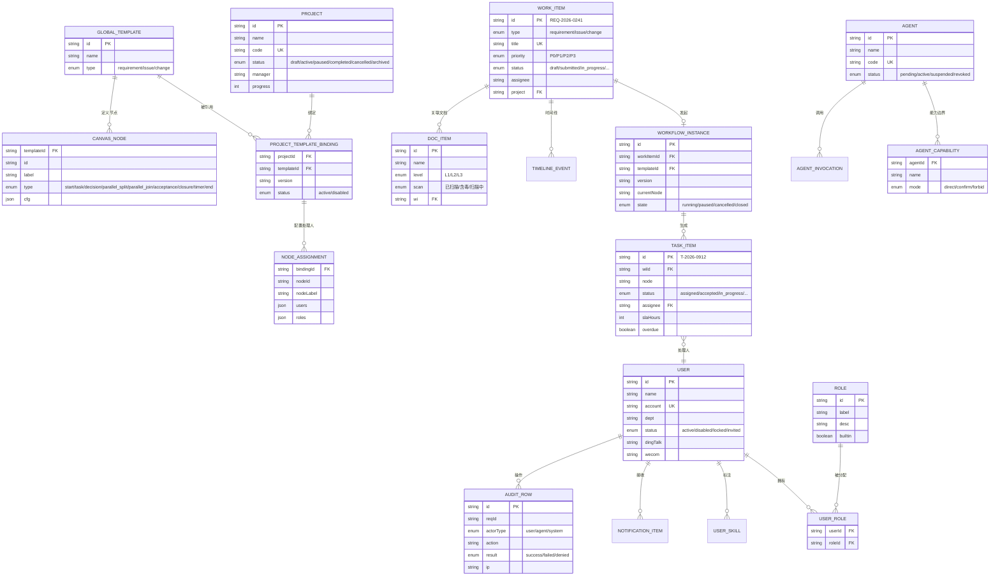

# 01 领域模型（实体 / 字段 / 枚举 / 关系）

来源：`frontend/src/types/index.ts` + `frontend/src/data/mock.ts`。所有字段以 TS 类型为准，枚举值为前端实际使用值。

## ER 总览



```
User ──< UserRole（多对多，roles[]）──> Role（9 内置 + 自定义）
User ──< UserSkill（多对多，skills[]）
Project ──< ProjectTemplateBinding ──< NodeAssignment
ProjectTemplateBinding ──> GlobalTemplate（templateId）
GlobalTemplate ──< nodes[] ──> CanvasNode（画布定义，按版本）
WorkItem ──> Project（project）
WorkItem ──< WorkItemStatusLog / TimelineEvent
TaskItem ──> WorkItem（wiId）
TaskItem ──> User（assignee）
Agent ──< AgentCapability（能力边界）
DocItem ──> Project / WorkItem（可选 wi）
NotificationItem（渠道投递）
AuditRow（全链路审计）
```

## 1. User 用户

| 字段 | 类型 | 说明 | mock 示例 |
|---|---|---|---|
| id | string | 用户 ID | `u1` |
| name | string | 显示名 | `张伟` |
| account | string | 登录账号 | `zhang.wei` |
| dept | string | 部门（路径式） | `售后服务部 / 深圳二部` |
| roles | string[] | 角色 ID 列表（多对多） | `['after_sales','leader']` |
| skills | string[] | 技能标签 | `['qa','frontend']` |
| avatarGrad | string? | 头像渐变 g1-g6 | `g1` |
| status | enum | `active` 在职 / `disabled` 停用 / `locked` 锁定 / `invited` 待激活 | |
| dingTalk | string? | 钉钉外部 ID（同步用） | `ding_zw` |
| wecom | string? | 企微外部 ID | `wx_zw` |
| load | number? | 当前负载（任务数） | `4` |

角色候选（9 内置）：`system_admin` `organization_admin` `project_admin` `leader` `product_manager` `developer` `after_sales` `pre_sales` `second_line`（中文名见权限文档）。
技能候选（4）：`backend` `frontend` `qa` `devops`。

## 2. Role 角色（权限矩阵）

| 字段 | 说明 |
|---|---|
| id | 角色 ID（内置：见上；自定义：小写字母开头 `[a-z][a-z0-9_]*`，全局唯一） |
| label | 中文名 |
| desc | 职责描述 |
| builtin | 是否内置（内置可删，但需强警告） |
| perms | `Record<权限点, boolean>`（34 权限点见 03 文档） |
| members | 角色成员用户 ID（`Role → User` 反向，与 User.roles 同一多对多） |

## 3. WorkItem 工作项

| 字段 | 类型 | 说明 |
|---|---|---|
| id | string | 编号，格式 `REQ-2026-0241` / `ISSUE-2026-0520`（组织编号规则） |
| type | enum | `requirement` 需求 / `issue` 问题 / （前端类型含 change 变更） |
| title | string | 标题（全局唯一，重复提交去重拦截） |
| project | string | 项目名 |
| priority | enum | `P0` `P1` `P2` `P3` |
| status | enum | `draft` `submitted` `in_progress` `waiting_for_information` `waiting_for_verification` `resolved` `accepted` `rejected` `closed` `cancelled` `archived` |
| assignee | string | 当前处理人 |
| creator | string | 创建人 |
| due | string | 截止（MM-DD） |
| labels | string[] | 标签 |
| progress | string? | 当前节点名 |
| tags | string[]? | 附加标签 |

## 4. TaskItem 任务

| 字段 | 类型 | 说明 |
|---|---|---|
| id | string | `T-2026-0912` |
| title | string | 工作项标题 |
| wiId | string | 关联工作项 |
| project | string | 项目 |
| node | string | 当前节点名（如 `测试`） |
| type | enum | requirement/issue |
| priority | enum | P0-P3 |
| status | enum | `assigned` `accepted` `in_progress` `waiting_for_information` `pending_confirmation` `submitted` `returned` `transferred` `completed` `cancelled` |
| assignee | string | 处理人 |
| due | string | 截止时间（MM-DD HH:mm） |
| slaHours | number | SLA 小时数 |
| overdue | boolean? | 是否超时 |
| agentPending | boolean? | 是否有 Agent 待确认 |
| source | string? | 来源（转办人等） |

## 5. Project 项目 + 模板绑定

### Project

| 字段 | 类型 | 说明 |
|---|---|---|
| id | string | `p1` |
| name / code | string | 名称 / 编码（大写唯一，如 `ORDER`） |
| status | enum | `draft` `active` `paused` `completed` `cancelled` `archived` |
| desc | string | 描述 |
| members / workItems | number | 成员数 / 工作项数 |
| progress | number | 进度 0-100 |
| manager / owner | string | 项目经理 / 归属部门 |
| updated | string | 更新时间 |
| readOnly | boolean? | 归档只读 |
| templateBindings | ProjectTemplateBinding[] | 模板绑定列表 |

### ProjectTemplateBinding（项目 × 模板实例）

| 字段 | 类型 | 说明 |
|---|---|---|
| templateId | string | 模板 ID（`tpl-req`/`tpl-issue`/`tpl-change`） |
| name | string | 模板名 |
| type | enum | requirement/issue/change |
| version | string | 绑定版本（如 `v3`） |
| status | enum | `active` 启用 / `disabled` 停用（停用不影响已运行实例） |
| assignments | NodeAssignment[] | **节点处理人绑定** |

### NodeAssignment（节点处理人绑定，PRD §4.5）

| 字段 | 类型 | 说明 |
|---|---|---|
| nodeId | string | 模板节点 ID（`n7` 等） |
| nodeLabel | string | 节点名（`测试`） |
| users | string[] | 绑定具体用户 ID（可多） |
| roles | string[] | 绑定角色/技能标签（流转时解析为所在**在职**用户） |

## 6. GlobalTemplate 模板池 + TemplateVersion

### GlobalTemplate

| 字段 | 类型 | 说明 |
|---|---|---|
| id | string | `tpl-req` / `tpl-issue` / `tpl-change` |
| name | string | 需求流程 / 问题流程 / 变更流程 |
| type | enum | requirement/issue/change |
| versions | string[] | 版本列表 |
| startSchema | FormField[] | 新建工作项硬性表单（起始节点 schema） |
| nodes | {id,label,type}[] | 节点清单（需求 10 / 问题 8 / 变更 6） |

### TemplateVersion

| 字段 | 类型 | 说明 |
|---|---|---|
| version | string | `v3` |
| status | enum | `draft` `reviewing` `published` `deprecated` `archived` |
| updated / updatedBy | string | 更新时间 / 人 |
| instances | number | 运行实例数 |
| nodes | number | 节点数 |

## 7. FormField 结构化表单（Schema）

| 字段 | 类型 | 说明 |
|---|---|---|
| key | string | 字段标识（`title`） |
| label | string | 中文标签 |
| type | enum | `input` `textarea` `select` `multiselect` `radio` `date` `number` `upload` `file` |
| required | boolean | 必填（前端禁用提交） |
| placeholder? / hint? | string | 占位/提示 |
| options? | {label,value}[] | 选项（select/multiselect/radio） |

## 8. CanvasNode 画布节点（模板定义）

| 字段 | 类型 | 说明 |
|---|---|---|
| id / label | string | `n1` / `需求提交` |
| type | enum | `start` `task` `decision` `parallel_split` `parallel_join` `acceptance` `closure` `timer` `end` |
| x / y / width / height | number | 画布坐标（8px 网格吸附） |
| cfg | object | 见下 |

cfg：
- `typeLine`：类型行文案（`START · 开始` / `TASK · 技能: qa` / `ACCEPTANCE · 验收` / `END · 结束`）
- `purpose`：节点目的说明
- `handler`：处理主体（`人工` / `人工 + Agent 可协助` / `系统`）
- `fallback`：允许回退目标（`需求拆分 / 后端开发 / 前端开发`，开始/结束不可回退）
- `sla`：SLA（`48 小时`）
- `schema`：FormField[]（节点表单）
- `output`：产出物说明

画布还含：`edges: [from,to][]`（主边）、`fallbacks: [from,to][]`（红色虚线回退边）。

## 9. Agent + AgentCapability

### Agent

| 字段 | 类型 | 说明 |
|---|---|---|
| id / name / code | string | ID / 名称 / 密钥代码（`agent_da_8f3k`，注册时一次性返回） |
| desc | string | 描述 |
| status | enum | `pending` 待审批 / `active` 活跃 / `suspended` 挂起 / `revoked` 吊销 |
| scope | string | 授权范围（组织/项目/服务） |
| bindings | string | 绑定节点（`REQ-2026-0238 · 需求分析`） |
| owner | string | 负责人 |
| calls / successRate / avgMs | number | 调用统计 |
| updated | string | 更新时间 |

### AgentCapability（能力边界）

| name | mode | 说明 |
|---|---|---|
| read_context / read_documents / read_history | `direct` | 只读，直接执行 |
| generate_content / write_form / append_form / upload_document / create_subtask | `confirm` | 需人工确认 |
| submit_task / return_task / transfer_task / pause_workflow / resume_workflow / close_work_item | `forbid` | 禁止（Agent 不可触碰） |

## 10. DocItem 文档

| 字段 | 类型 | 说明 |
|---|---|---|
| id / name / project | string | ID / 文件名 / 所属项目 |
| version | string | 版本 |
| level | enum | `L1`（内部）`L2`（受控）`L3`（机密） |
| scan | enum | `已扫描` `含毒` `扫描中` |
| uploader | string | 上传人 |
| size / time | string | 大小 / 时间 |
| kind | string | 类型（需求文档/设计文档/测试结果/原型/截图/日志/接口文档…） |
| wi | string? | 关联工作项 |

## 11. NotificationItem 通知

| 字段 | 类型 | 说明 |
|---|---|---|
| id / title / body / time | string | |
| channels | {name,ok}[] | 渠道投递结果（钉钉/企微/邮件/站内） |
| unread | boolean? | 未读 |
| kind | enum | `arrive` 任务到达 `agent` Agent确认 `timeout` 超时 `return` 退回 `complete` 完成 `transfer` 转办 `info` 信息 `fail` 失败 |
| failed | boolean? | 发送失败 |
| retries | number? | 重试次数 |

## 12. AuditRow 审计

| 字段 | 类型 | 说明 |
|---|---|---|
| time | string | 时间 |
| actor / actorType | string / enum | 操作者（`user`/`agent`/`system`） |
| authorized | string | 授权用户（Agent 行为时） |
| action | string | 动作码（`task:submit` `document:upload` `org:sync` `workflow_instance:cancel` 等，见 03 权限点命名） |
| target | string | 目标 |
| result | enum | `success` `failed` `denied` |
| reqId | string | 请求 ID（`req_f2a9…`） |
| ip | string | 来源 IP |

## 13. 其他前端结构

- **TimelineEvent**：时间线（id/time/title/desc/by/kind: `user`|`agent`|`system`|`action`）
- **FlowNode**：节点进度（name/status: `done`|`current`|`wait`|`return`/assignee/time）
- **ActivityItem**：活动动态（time/title/desc/by/kind: `done`|`cur`|`wait`|`agent`）
- **dashboard 聚合**：kpis（运行中流程/今日完成/超时节点/Agent待确认）、weekly 周趋势、typeSplit 类型占比、deptLoad 部门负载、timeoutTop 超时 Top、nodeHeat 节点热度
- **registerApprovals**：注册审批（id/name/email/dept/role/applied）
- **deptTree**：部门同步树（name/users/sync）
