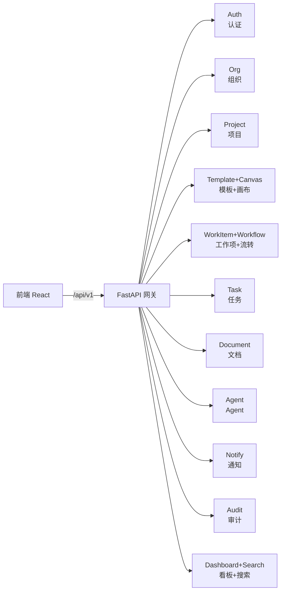
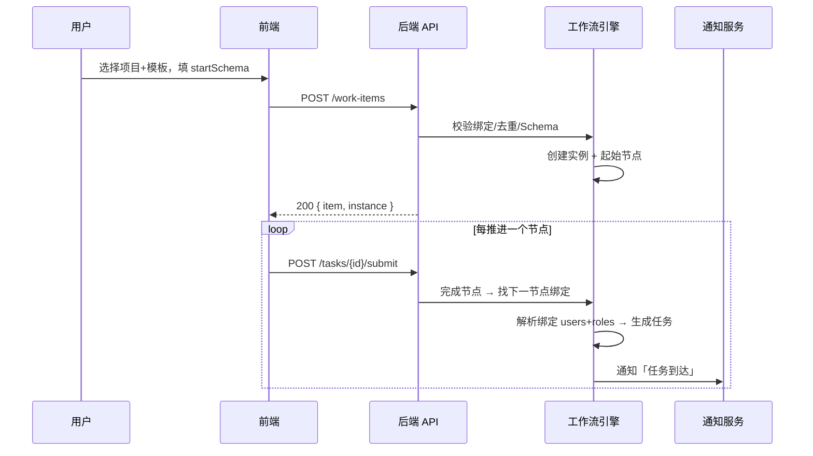
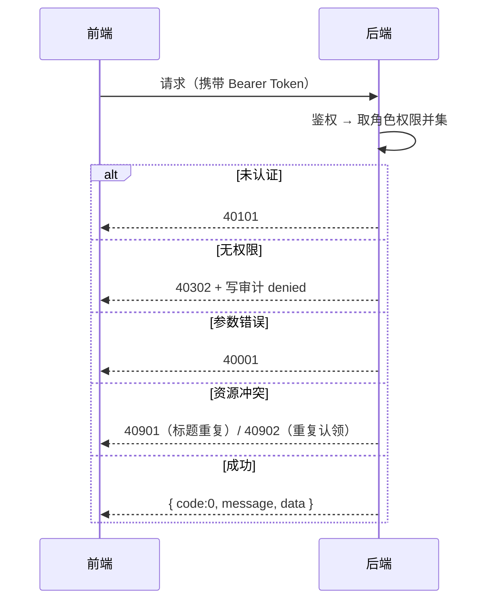

# 02 REST API 规格

来源：前端页面交互（pages/*）、弹窗（dialogs.tsx）、mock 数据（data/mock.ts）。所有端点 `/api/v1` 前缀，统一响应 `{ code, message, data }`。

约定：写操作必须写审计（actor/action/target/result/req_id/ip）；`*_id` 为用户 ID/角色 ID/模板 ID/项目 ID 等内部 ID。

## 模块总览

## 关键时序：新建工作项 → 自动流转

## 统一响应与鉴权

---

## 一、认证 Auth

### 1.1 免登验签（钉钉/企微）

- `POST /auth/sso/verify`
- 请求：`{ provider: 'dingtalk'|'wecom', ticket: string, redirect_uri?: string }`
- 响应：`{ token, user: UserBrief }`；前端 toast「免登成功：身份票据验签通过，映射为 张伟（深圳二部）」

### 1.2 本地账号登录

- `POST /auth/login`
- 请求：`{ account, password }`
- 响应：`{ token, user }`；连续失败锁定（R-155 密码策略、锁定状态）

### 1.3 注册本地账号

- `POST /auth/register`
- 请求：`{ account, name, email, dept, role, skills?, password }`
- 行为：创建 user（status=invited）+ 邮件/站内通知；管理员审批（见 1.5）
- 响应：`{ user, notice }`

### 1.4 修改密码

- `POST /auth/change-password`
- 请求：`{ old_password, new_password }`；首登强制改密标记 `must_change_password`

### 1.5 注册审批（管理员）

- `GET /auth/approvals?status=pending` — 待审批列表（mock registerApprovals 4 条）
- `POST /auth/approvals/{id}/approve` — 通过：创建 user + 本地凭证（同事务），通知申请者
- `POST /auth/approvals/{id}/reject` — 拒绝

### 1.6 登出

- `POST /auth/logout`

---

## 二、组织管理 Org

### 2.1 组织概览

- `GET /org/overview`
- 响应：`{ departments, users, synced_ding, synced_wecom, pending_approve, last_sync }`

### 2.2 用户管理

- `GET /org/users?dept=&status=&keyword=&page=1&page_size=20`
- 响应：`{ items: User[], total }`
- `POST /org/users` — 创建本地用户（管理员）：`{ account, name, email, dept, role, skills, password }`
- `PATCH /org/users/{id}` — 更新：`{ dept?, status?, roles?, skills? }`（**角色/技能变更须写审计 before/after**）
- `POST /org/users/{id}/unlock` — 解锁（记录解锁人 + 审计）

### 2.3 组织同步

- `POST /org/sync` — 立即同步：调用钉钉/企微组织接口
  - 行为：新增/变更/停用（**停用用户置 disabled，已有任务必须转办或管理员接管**）；同步失败保留已有数据不破坏
- `GET /org/sync/status` — 同步状态（deptTree：部门/人数/各渠道 ✓✗）

### 2.4 角色解析（供节点绑定用）

- `GET /org/users/by-role?role=qa&active_only=true` — 返回该角色/技能所在在职用户

---

## 三、项目 Projects

### 3.1 列表

- `GET /projects?status=&keyword=&sort=updated&page=1&page_size=20`
- 响应：`{ items: Project[], total }`；Project 含 `templateBindings`（含 assignments）

### 3.2 详情

- `GET /projects/{id}`

### 3.3 创建 / 更新

- `POST /projects`
- `PATCH /projects/{id}`
- 请求体：`{ name, code, status, desc, manager, templateBindings: [{ templateId, version, status, assignments: [{ nodeId, nodeLabel, users[], roles[] }] }] }`
- 校验：name/code 必填；code 大写唯一；模板绑定变更写审计（before/after）

### 3.4 归档 / 取消

- `POST /projects/{id}/archive`（归档只读 readOnly=true）
- `POST /projects/{id}/cancel`

---

## 四、流程模板 Templates

### 4.1 模板池

- `GET /templates/pool` — 全局模板（globalTemplates）：id/name/type/versions/startSchema/nodes

### 4.2 版本列表（按模板）

- `GET /templates/{templateId}/versions` — TemplateVersion[]（draft/reviewing/published/deprecated/archived）

### 4.3 创建新版本

- `POST /templates/{templateId}/versions` — 基于当前 published 复制为 draft 草稿（实例数 0）

### 4.4 评审 / 发布 / 归档

- `POST /templates/{templateId}/versions/{v}/review` — 提交评审
- `POST /templates/{templateId}/versions/{v}/publish` — 发布（校验：开始/结束数量、入出边、悬空节点、回退自指；失败阻断并返回校验报告）
- `POST /templates/{templateId}/versions/{v}/archive`

### 4.5 被绑定项目数

- `GET /templates/{templateId}/bindings` — 返回引用该项目模板绑定的项目列表

---

## 五、流程画布 Canvas（模板定义 CRUD）

### 5.1 读取

- `GET /templates/{templateId}/versions/{v}/canvas`
- 响应：`{ nodes: CanvasNode[], edges: [from,to][], fallbacks: [from,to][] }`

### 5.2 保存草稿（编辑模式）

- `PUT /templates/{templateId}/versions/{v}/canvas`
- 请求：`{ nodes, edges, fallbacks }`；仅 draft 版本可写；保存生成快照（新版本）

### 5.3 校验

- `POST /templates/{templateId}/versions/{v}/canvas/validate`
- 校验项：开始节点=1、结束节点=1、节点入出边完整、无悬空节点、回退不指向自身、开始/结束不可回退
- 响应：`{ ok, errors: [{ node_id, message }] }`

---

## 六、工作项 Work Items

### 6.1 列表

- `GET /work-items?type=&status=&project=&priority=&page=1&page_size=20`

### 6.2 详情

- `GET /work-items/{id}` — 含 `{ item, flowNodes, timeline, docs, inheritedForm }`

### 6.3 新建（发起流程）

- `POST /work-items`
- 请求：`{ project_id, template_id, version, start_schema_values: { title, description, ... } }`
- 行为：
  - 模板由项目绑定过滤（项目未绑定该模板 → 拒绝，前端禁用提交）
  - startSchema 必填项未填 → 400
  - title 全局唯一，重复提交 → 409 去重拦截
  - 创建 WorkItem（status=draft/submitted）+ 流程实例（起始节点）+ 时间线事件
- 响应：`{ item, instance }`

### 6.4 状态流转（节点动作）

- `POST /work-items/{id}/actions`
- 请求体：`{ action: 'submit'|'return'|'transfer'|'claim'|'pause'|'cancel'|'request_info', ... }`
  - submit：`{ node_id, form_values, outputs? }`（SchemaForm 提交，必填校验）
  - return：`{ to_node_id, reason }`（目标须在节点允许回退列表，写时间线「节点退回」）
  - transfer：`{ to_user_id, note? }`（写审计 task:transfer + 通知转办）
  - claim：认领（重复认领 409）
  - pause/cancel：暂停/取消流程（权限见权限文档）
- 响应：`{ item, next_node, next_assignees }`（next_assignees 为下一节点绑定解析出的处理人）

### 6.5 手动停止

- `POST /work-items/{id}/stop` — 权限 `workflow_instance:cancel`（系统/组织/项目管理员）
- 行为：
  - 工作项状态置 `cancelled`，流程实例 state 置 `cancelled`
  - 所有未终结任务（assigned / in_progress / pending_confirmation 等）置 `cancelled`；后台 Expert Run 完成回调检测到非 pending_confirmation 自动放弃采纳
  - 写审计 `workflow_instance:cancel`（携带被取消任务 ID 列表），站内通知创建人与被取消任务处理人
  - 已终结（closed / cancelled / archived）→ 409
- 响应：`{ item }`

---

## 七、我的任务 Tasks

### 7.1 列表

- `GET /tasks?status=&node=&project=&priority=&overdue=&agent_pending=&page=1&page_size=20`
- 响应：`{ items: TaskItem[], total }`

### 7.2 详情（节点处理页）

- `GET /tasks/{id}` — 含 `{ task, flowNodes, inheritedDocs, inheritedForm, timeline, agentSuggestions }`

### 7.3 节点候选处理人（绑定解析）

- `GET /tasks/{id}/candidates`
- 响应：`{ users: [{id,name,dept}], roles: [{role, resolved_users}] }`
- 解析规则：项目×模板绑定 assignments → 绑定 users + roles（role→**在职**用户，含 skills 匹配）

### 7.4 任务动作

- `POST /tasks/{id}/submit` — 提交（form_values 按节点 schema 校验）
- `POST /tasks/{id}/return` — 退回
- `POST /tasks/{id}/transfer` — 转办
- 成功后：任务自动流转到下一节点 → 按绑定生成新任务 + 通知（任务到达）

---

## 八、文档中心 Documents

### 8.1 列表/搜索

- `GET /documents?name=&project=&level=&scan=&wi=&page=1&page_size=5`（前端每页 5 条真实分页）

### 8.2 上传

- `POST /documents/upload`（multipart）
- 校验链：扩展名白名单 → MIME → 大小（压缩炸弹）→ **病毒扫描**；含毒 → 拒绝并审计 file:scan failed
- 响应：`{ doc }`

### 8.3 下载（短时链接）

- `POST /documents/{id}/link` — 权限代理校验通过，生成**短时链接**（过期 403，前端 toast「权限代理校验通过，已生成短时链接」）

### 8.4 删除 / 恢复

- `DELETE /documents/{id}`（权限：document:delete）
- `POST /documents/{id}/restore`（document:restore）

---

## 九、Agent 管理

### 9.1 列表 + KPI

- `GET /agents` — `{ items: Agent[], kpi: { total, active, monthly_calls, avg_ms, pending_approve } }`

### 9.2 注册

- `POST /agents/register`
- 请求：`{ name, desc, scope?, capabilities? }`
- 行为：**密钥一次性返回**（仅此一次展示），status=pending；通知审批
- 响应：`{ agent, secret }`

### 9.3 绑定 / 授权

- `POST /agents/{id}/bind` — `{ scope, bindings, capabilities? }`（agent:bind）
- `POST /agents/{id}/authorize` — `{ user_ids, capabilities: [{name, mode}] }`（agent:authorize）

### 9.4 状态

- `POST /agents/{id}/suspend` — 挂起：拒绝新调用，存量请求完成后退场
- `POST /agents/{id}/activate` — 激活
- `POST /agents/{id}/revoke` — 吊销：密钥立即失效，请求拒绝并审计

### 9.5 能力边界

- `GET /agents/capabilities` — `[{name, mode: direct|confirm|forbid}]`（14 项见领域模型）

---

## 十、通知中心 Notifications

### 10.1 列表

- `GET /notifications?kind=&unread=&page=1&page_size=20`
- 响应：`{ items: NotificationItem[], unread_count }`

### 10.2 已读

- `POST /notifications/read` — `{ ids?: string[] }`（空 = 全部已读）

### 10.3 重试

- `POST /notifications/{id}/retry` — 重发失败渠道；mock：企微渠道第 2 次重试失败（notification:retry 审计 failed）

### 10.4 渠道状态

- `GET /notifications/channels/health` — 钉钉/企微/邮件/站内可用性

---

## 十一、审计中心 Audit

### 11.1 列表（分页 + 过滤）

- `GET /audits?action=&result=&actor_type=&page=1&page_size=5`
- 响应：`{ items: AuditRow[], total, page, page_size }`

### 11.2 导出

- `POST /audits/export`
- 行为：**导出本身写一条新审计事件**（audit:export，前端 toast「导出将记录一次新的审计事件」）

---

## 十二、领导看板 Dashboard

- `GET /dashboard/overview`
- 响应：`{ kpis: [{label,value,delta,up}], weekly: [{d,v}], type_split: [{name,value,color}], dept_load: [{name,v}], timeout_top: [{name,v}], node_heat: [{name,v}] }`

---

## 十三、全局搜索

- `GET /search?q=&type=workitem|task|document`
- 响应：`{ items: [{ type, title, desc, to }] }`；前端顶栏快捷定位 3 项 + Enter 搜索跳转

---

## 错误码约定

| code | HTTP | 说明 |
|---|---|---|
| 0 | 200 | 成功 |
| 40001 | 400 | 参数校验失败（schema 必填缺失等） |
| 40101 | 401 | 未认证 / 票据失效 |
| 40301 | 403 | 无权限（denied，须写审计 result=denied） |
| 40302 | 403 | 角色无此权限点 |
| 40401 | 404 | 资源不存在 |
| 40901 | 409 | 标题重复（工作项去重） |
| 40902 | 409 | 重复认领 / 重复操作 |
| 42201 | 422 | 流程校验不通过（发布阻断） |
| 42301 | 423 | 用户锁定 |
| 50000 | 500 | 内部错误 |
