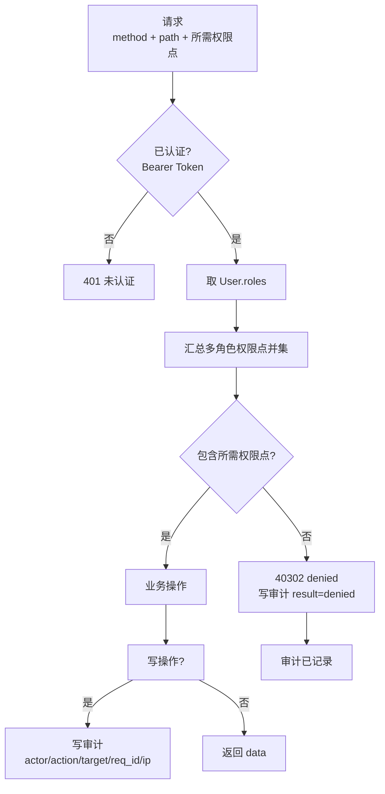
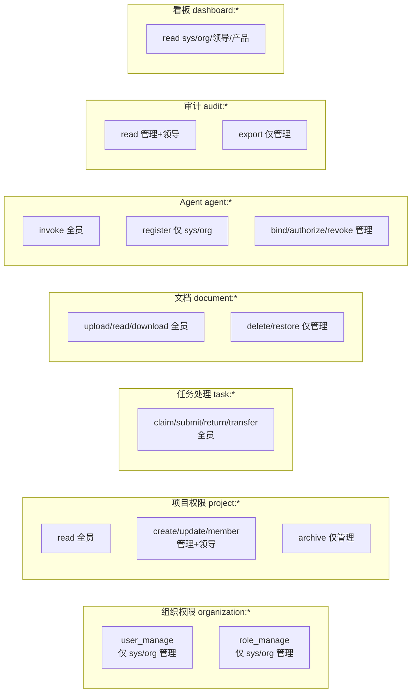

# 03 认证与权限模型

来源：`frontend/src/pages/matrix.tsx`、`frontend/src/data/mock.ts`（matrixRoles/matrixRows）、`app-store.tsx`（角色视角）、dialogs（防自锁/五层交集拒绝演示）。

## 1. 认证方式

| 方式 | 说明 |
|---|---|
| SSO 免登 | 钉钉 / 企微票据验签 → 映射组织用户（「免登成功：身份票据验签通过，映射为 张伟（深圳二部）」） |
| 本地账号 | account + password；首登强制改密（R-155）；连续失败锁定；解锁需记录解锁人并审计 |
| 注册审批 | 本地账号注册 → 管理员审批 → 创建 user + 凭证（同事务）|

## 2. 角色（9 内置 + 自定义）

| 角色 ID | 中文名 | 职责 |
|---|---|---|
| system_admin | 系统管理员 | 全平台最高权限，管理组织与系统配置；**防自锁保护** |
| organization_admin | 组织管理员 | 组织用户/角色/同步与审计管理 |
| project_admin | 项目管理员 | 项目管理、成员管理与模板发布 |
| leader | 领导 | 组织级看板与全局数据范围 |
| product_manager | 产品经理 | 需求流程主导与验收 |
| developer | 开发 | 研发节点处理（技能标签细分 backend/frontend/qa） |
| after_sales | 售后 | 问题提报、分诊与闭环确认 |
| pre_sales | 售前 | 方案导入与需求前置 |
| second_line | 二线 | 问题深度排查与根因分析 |

- 自定义角色：`id` 小写字母开头、仅字母数字下划线、全局唯一；支持复制现有角色权限作为初始值。
- **内置角色可删除**（前端已放开）：删除需强警告——影响 N 位成员 + 节点绑定解析失效 + 内置定义移除；历史审计保留。

## 3. 权限点（34 个，前端 matrixRows 全量）

### 组织权限 organization:*
- `organization:user_manage` 用户管理 — [✓✓✗✗✗✗✗✗✗]
- `organization:role_manage` 角色管理 — [✓✓✗✗✗✗✗✗✗]

### 项目权限 project:*
- `project:create` 创建项目 — [✓✓✓✓✗✗✗✗✗]
- `project:read` 查看项目 — [全 ✓]
- `project:update` 编辑项目 — [✓✓✓✓✗✗✗✗✗]
- `project:archive` 归档项目 — [✓✓✓✗✗✗✗✗✗]
- `project:member_manage` 成员管理 — [✓✓✓✗✗✗✗✗✗]

### 流程模板 workflow_template:*
- `workflow_template:create` 创建模板 — [✓✓✓✗✗✗✗✗✗]
- `workflow_template:read` 查看模板 — [全 ✓]
- `workflow_template:update` 编辑模板 — [✓✓✓✗✗✗✗✗✗]
- `workflow_template:review` 评审模板 — [✓✓✓✗✗✗✗✗✗]
- `workflow_template:publish` 发布模板 — [✓✓✓✗✗✗✗✗✗]
- `workflow_template:archive` 归档模板 — [✓✓✓✗✗✗✗✗✗]

### 流程实例 workflow_instance:*
- `workflow_instance:create` 发起流程 — [全 ✓]
- `workflow_instance:read` 查看实例 — [全 ✓]
- `workflow_instance:pause` 暂停流程 — [✓✓✓✓✗✗✗✗✗]（节点页提示「仅项目管理员可暂停」）
- `workflow_instance:cancel` 取消流程 — [✓✓✓✗✗✗✗✗✗]

### 任务处理 task:*
- `task:claim` 认领任务 — [全 ✓]
- `task:submit` 提交任务 — [全 ✓]
- `task:return` 退回任务 — [全 ✓]
- `task:transfer` 转办任务 — [全 ✓]

### 文档管理 document:*
- `document:upload` 上传文档 — [全 ✓]
- `document:read` 查看文档 — [全 ✓]
- `document:download` 下载文档 — [全 ✓]
- `document:delete` 删除文档 — [✓✓✓✗✗✗✗✗✗]
- `document:restore` 恢复文档 — [✓✓✓✗✗✗✗✗✗]

### Agent 管理 agent:*
- `agent:register` 注册 Agent — [✓✓✗✗✗✗✗✗✗]
- `agent:bind` 绑定 Agent — [✓✓✓✗✗✗✗✗✗]
- `agent:invoke` 调用 Agent — [全 ✓]
- `agent:authorize` 授权 Agent — [✓✓✓✗✗✗✗✗✗]
- `agent:revoke` 吊销 Agent — [✓✓✓✗✗✗✗✗✗]

### 审计 audit:*
- `audit:read` 查看审计 — [✓✓✓✓✗✗✗✗✗]
- `audit:export` 导出审计 — [✓✓✓✗✗✗✗✗✗]

### 领导看板 dashboard:*
- `dashboard:read` 查看看板 — [✓✓✗✓✓✗✗✗✗]

> 方括号顺序与角色表一致：system_admin, organization_admin, project_admin, leader, product_manager, developer, after_sales, pre_sales, second_line。

## 4. RBAC 判定流程（后端必须实现）

1. 取当前用户 roles（User.roles）
2. 汇总所有角色的权限点（多角色取并集）
3. 请求所需权限点不在并集中 → **40302 denied，且必须写审计 result=denied**
4. 所有写操作审计：`{ actor, actor_type, authorized_user_id, action, target, result, request_id, ip, before?, after? }`（PRD §12）

## 4.1 权限矩阵热力分布（34 权限点 × 9 角色）

## 5. 防自锁保护（system_admin）

- `organization:user_manage` 对 system_admin 永久锁定：后端必须拒绝任何对该角色此权限的降权操作（Switch disabled + 琥珀高亮 + 「防自锁」徽标）。
- 删除 system_admin 角色或移除其最后一位成员同样禁止。

## 6. 角色 ↔ 用户（双向，多对多）

- 用户维度：`User.roles[]`（组织管理编辑弹窗分配角色/技能）
- 角色维度：`Role.members[]`（权限矩阵抽屉「角色成员（用户）」区分配）
- **两处必须实时双向同步**（前端已实现单一事实源：角色成员列表由用户表派生；后端应建模为 join 表 `user_roles(user_id, role_id)`，任何一处变更即生效）
- 角色解析（节点绑定）：`role → 在职用户`；技能同理 `skill → 用户`（`u.status === 'active' && (u.roles.includes(r) || u.skills.includes(r))`）

## 7. 角色视角切换（前端演示）

- `leader` → 张伟（zhang.wei · after_sales · leader）
- `org` → 李婷（liting · organization_admin）
- `dev` → 孙琳（sunlin · developer · qa）
- `sales` → 陈新（chenxin · after_sales）
- 规则：不可见页面不渲染导航，直接访问路由 → 403

## 8. 五层交集拒绝（权限演示）

前端有「五层交集拒绝演示」入口（permissionDemo 弹窗）：演示多权限点组合判定（角色权限 × 项目绑定 × 节点绑定 × Agent 授权 × 组织范围等交叠拒绝），后端权限判定需支持**多维度叠加**而非仅角色。
