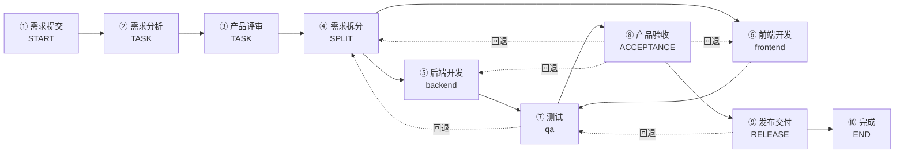
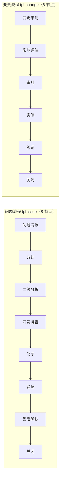
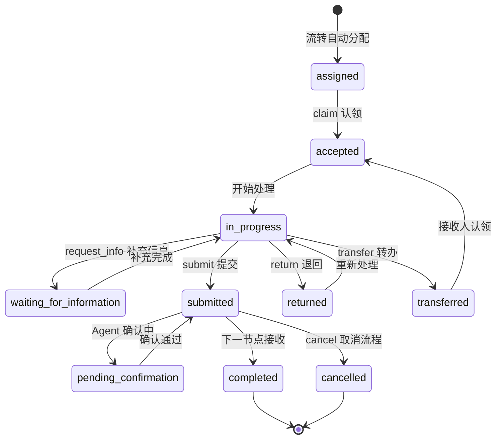
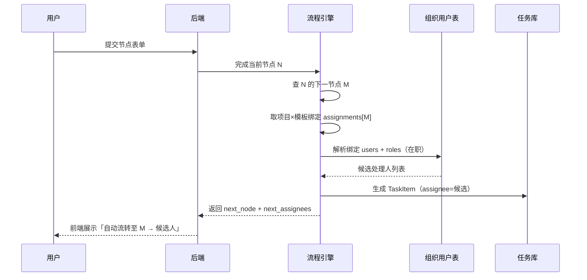

# 04 工作流引擎设计

来源：`frontend/src/data/mock.ts`（globalTemplates/canvasNodes/canvasEdges/canvasFallbacks/NODE_CFG）、`src/pages/canvas.tsx`（画布编辑）、`src/pages/node.tsx`（节点处理）、`src/components/dialogs.tsx`（节点绑定/新建工作项）、`src/types/index.ts`。

## 1. 核心概念

| 概念 | 说明 |
|---|---|
| 模板 Template | 类型：需求流程（tpl-req，10 节点）/ 问题流程（tpl-issue，8 节点）/ 变更流程（tpl-change，6 节点）；含版本（v1..v4）与节点图 |
| 版本 Version | draft → reviewing → published → deprecated/archived；**已发布版本不可修改**，编辑必须新建草稿版本 |
| 项目×模板绑定 | 项目绑定多条流程线（active/disabled）；**disabled 不影响已运行实例** |
| 节点绑定 NodeAssignment | 每节点可绑定多个用户 + 多个角色/技能；流转到该节点时自动生成任务分配给绑定处理人 |
| 实例 Instance | 工作项发起即创建实例，沿节点图流转 |

## 1.1 需求流程节点图（tpl-req v3）



> 主边实线；回退边虚线（红色，须在节点 fallback 白名单内）。

## 1.2 问题流程 / 变更流程



## 2. 节点类型（9 种）

| type | 含义 | 前端样式 |
|---|---|---|
| `start` | 开始 | START · 开始（不可回退） |
| `task` | 任务 | TASK · 可标注技能（`TASK · 技能: qa`） |
| `decision` | 决策 | 分支 |
| `parallel_split` / `parallel_join` | 并行分支/汇聚 | |
| `acceptance` | 验收 | ACCEPTANCE · 验收（不通过必须填意见+回退节点） |
| `closure` | 闭环 | |
| `timer` | 定时 | |
| `end` | 结束 | END · 结束（handler=系统，无表单） |

## 3. 节点属性（cfg）

```
{ typeLine, purpose, handler, fallback, sla, schema: FormField[], output }
```

- handler：`人工` / `人工 + Agent 可协助` / `系统`
- fallback：允许回退的节点名列表（如 测试 → `需求拆分 / 后端开发 / 前端开发`；开始/结束不可回退）
- sla：SLA 时长（`48 小时`），超时通知项目管理员
- schema：节点表单（FormField[]，驱动提交/退回必填校验）

## 4. 图结构

- `edges: [from, to][]` — 主流转边
- `fallbacks: [from, to][]` — 回退边（画布红色虚线）
- 需求流程 v3 边示例：
  - 主边：n1→n2→n3→n4→(n5,n6)→n7→n8→n9→n10
  - 回退：n7→n4（测试→需求拆分）、n8→n4/n5/n6（验收→拆分/后端/前端）、n9→n7（发布→测试）

## 5. 流转引擎（状态机）

### 5.1 发起（新建工作项）

1. 前端选项目 → 选模板（**仅项目已绑定模板可选**，未绑定禁用提交）
2. 按模板 `startSchema` 渲染硬性表单；必填缺失 → 前端禁用提交、后端 400
3. `title` 全局唯一 → 重复 409 去重拦截
4. 创建：WorkItem + 实例（起始节点） + 时间线事件「节点到达 · 需求提交」

### 5.2 节点动作（当前节点 → 下一节点）



| 动作 | 前置 | 行为 |
|---|---|---|
| claim 认领 | task:claim | 认领任务（重复 409）；审计 task:claim |
| submit 提交 | task:submit | 校验节点 schema 必填 → 完成当前节点 → 沿主边推进到下一节点 → **按绑定生成任务** → 通知（任务到达，钉钉+企微） |
| return 退回 | task:return | 目标必须在节点 fallback 列表 → 回退到目标节点 → 时间线「节点退回」+ 通知 |
| transfer 转办 | task:transfer | 转办给指定用户 → 审计 task:transfer → 通知（任务转办） |
| request_info 补充信息 | — | SLA 暂停计时；通知（补充信息请求） |
| pause / cancel | 权限 | 暂停/取消实例；cancel 写审计 workflow_instance:cancel |

### 5.3 自动分配（PRD §4.5 核心）



流转到节点 N 时：
1. 取项目×模板绑定中 N 的 `assignments`
2. 候选 = 绑定 users + 绑定 roles 解析出的**在职**用户（`status==='active' && (roles.includes(r) || skills.includes(r))`）
3. 生成 TaskItem 分配给候选处理人（一人多选时全部分配，前端展示全部候选）
4. 若 N 未配置绑定 → 回退到人工指定（无候选，任务待分配）

### 5.4 工作项状态映射

节点推进同步工作项 status：draft → submitted → in_progress → waiting_for_information / waiting_for_verification → resolved（验收通过）→ accepted → closed（结束节点）；rejected（验收不通过退回）；cancelled / archived。

## 6. 表单 Schema 引擎

- `FormField` 9 种控件：input/textarea/select/multiselect/radio/date/number/upload/file
- 校验：required + 类型（date/number）+ 多选（multiselect）
- 上传字段：拖拽上传记录文件名（多文件可选）
- 继承：下游节点展示上游节点只读表单/文档（inheritedForm/inheritedDocs）

## 7. 画布编辑（模板设计器）

- view/edit 双模式；编辑 = 新建草稿版本（快照）
- 支持：节点拖拽（8px 网格吸附+边界钳制）、端口拖线建边、Delete 删除节点/边、添加 7 类节点（自动找空位）、属性面板全字段编辑（实时写回）、回退目标下拉配置（生成红色虚线）、快照/恢复
- **发布校验**（前端静态校验，后端 publish 必须重放）：开始节点=1、结束节点=1、节点入出边、无悬空、回退不自指；失败阻断并返回校验报告

## 8. SLA 与超时

- 每节点 cfg.sla 定义时长；任务创建时计算 due = now + sla
- 超时：通知项目管理员（kind=timeout「SLA 超时」）；看板 timeout_top 聚合
- 补充信息请求：SLA 暂停计时

## 9. 数据库建议（最小表）

```
workflow_templates(id, name, type, version, status, definition_json)  -- 节点图整体存 JSON
project_template_bindings(project_id, template_id, version, status)
node_assignments(binding_id, node_id, node_label, user_ids, role_ids)
work_items(id, type, title, project_id, priority, status, ...)
workflow_instances(id, work_item_id, template_id, version, current_node, state)
tasks(id, wi_id, node, assignee, status, sla_hours, due, ...)
task_actions(id, task_id, action, actor, payload_json, created_at)
```
