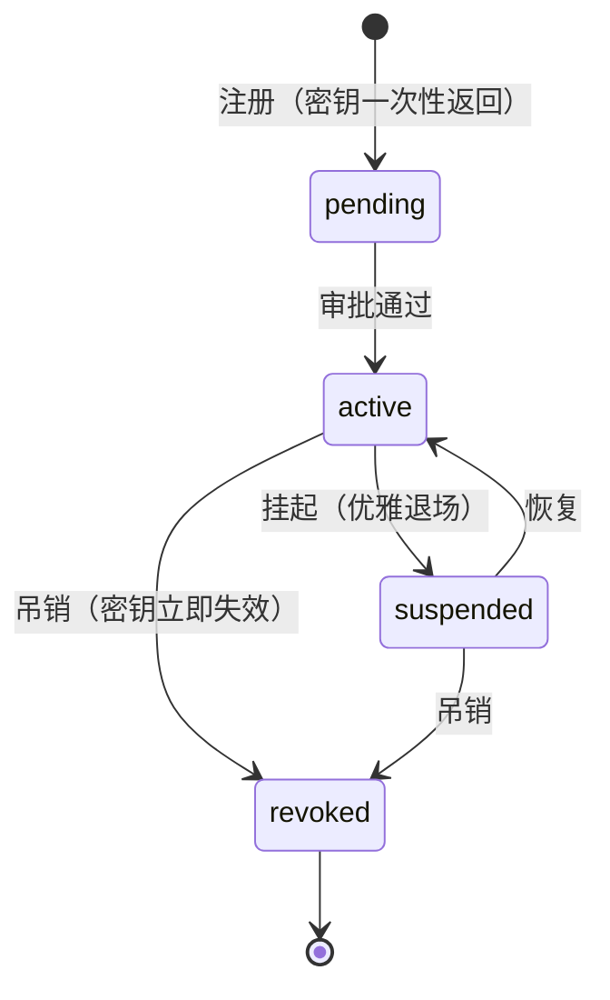
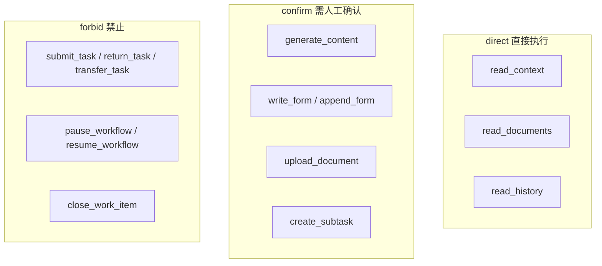
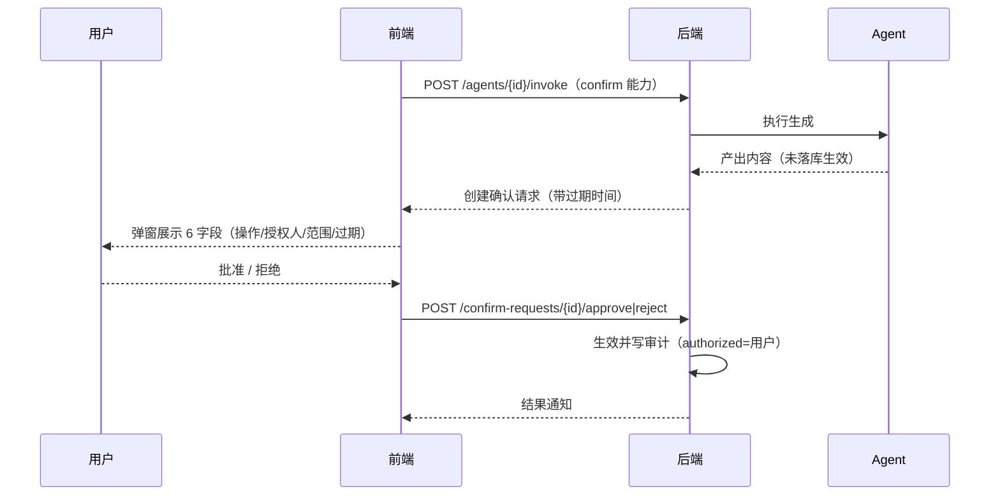

# 05 Agent 集成

来源：`frontend/src/data/mock.ts`（agents/agentKpi/agentCapabilities/agentConfirmRequest/agentSuggestions）、`frontend/src/pages/agents.tsx`、`src/components/dialogs.tsx`（AgentRegister/AgentConfirm）。

## 1. Agent 状态机



| 状态 | 行为 |
|---|---|
| pending | 注册后待管理员审批；调用数 0 |
| active | 可接受绑定与调用 |
| suspended | 拒绝新调用；**存量请求完成后退场**（优雅退出） |
| revoked | 密钥立即失效；请求拒绝并审计（密钥泄露场景） |

## 2. 注册流程

1. `POST /agents/register` → 生成 `code`（如 `agent_da_8f3k`）与 **secret（一次性返回，仅展示一次）**；status=pending
2. 管理员审批（挂起/激活/吊销按钮）
3. 绑定：`scope`（组织/项目/服务）+ `bindings`（节点，如 `REQ-2026-0238 · 需求分析` / `测试节点 · qa 技能`）

## 3. 能力边界（14 项，三种模式）



| mode | 语义 | 能力 |
|---|---|---|
| `direct` | 直接执行（无需确认） | read_context / read_documents / read_history |
| `confirm` | 需人工确认 | generate_content / write_form / append_form / upload_document / create_subtask |
| `forbid` | **禁止**（Agent 不可触碰） | submit_task / return_task / transfer_task / pause_workflow / resume_workflow / close_work_item |

## 4. 调用与确认（Agent Confirm）

### 4.1 调用

- `POST /agents/{id}/invoke` — 按能力 mode 分流：
  - direct：直接执行
  - confirm：创建**确认请求**（等待人工）
  - forbid：拒绝（Agent 不可提交/退回/转办任务、不可暂停/恢复/关闭流程）

### 4.2 确认请求（前端 agentConfirm 弹窗字段）



| 字段 | 示例 |
|---|---|
| agentName / agentDesc | FlowBot-DA / 数据分析助手 |
| agentCode | agent_da_8f3k |
| action | generate_content → write_form |
| authorizedUser | 张伟（after_sales） |
| project / node | 订单中心 / REQ-2026-0238 · 需求分析 |
| opScope | generate_content / write_form |
| execMode | 需确认（非 direct） |
| expire | 今日 16:40（剩余 1h42m）—— **确认请求带过期时间** |

- `POST /agents/confirm-requests/{id}/approve` — 授权确认（写审计：actor=授权用户，authorized_user 记录）
- `POST /agents/confirm-requests/{id}/reject` — 拒绝

### 4.3 Agent 操作审计（授权交集六字段）

Agent 行为审计含：actor（agent）/ actorType=agent / **authorized（授权用户）** / action（agent:xxx）/ target / result；即「Agent 执行的操作必须挂到授权用户上」。

## 5. 建议（Agent 产出，未自动执行）

- 节点页展示 Agent 建议列表：`{ title, body, status: '建议（未执行）', time }`
- 示例：FlowBot-TEST 生成 38 条测试用例草稿（建议，未自动执行）；FlowBot-DA 风险提示
- 建议不写库？——建议持久化到节点上下文，供后续查看

## 6. 调用统计（Agent 管理 KPI）

```
{ total, active, monthly_calls, avg_ms, pending_approve }
```
单 Agent：`calls / successRate / avgMs`（如 FlowBot-DA 482 次 / 96.4% / 2400ms）。

## 7. 回调 / 结果

- Agent 异步执行完成后回调（`/agents/callbacks/...`），结果写入节点上下文；confirm 模式下结果需人工确认后生效
- 前端时间线事件 kind=agent（如「Agent 建议生成」by=FlowBot-TEST）
