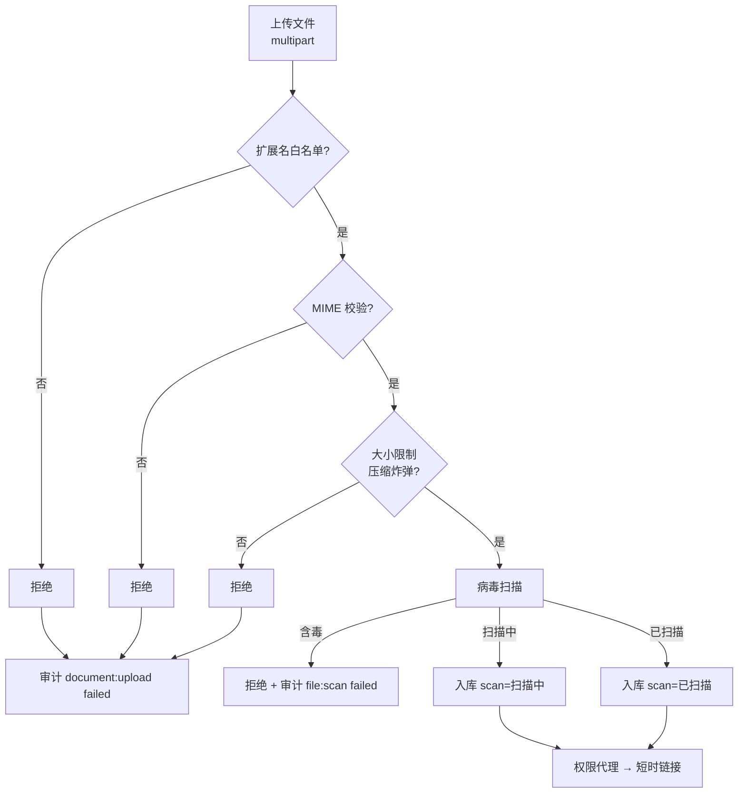
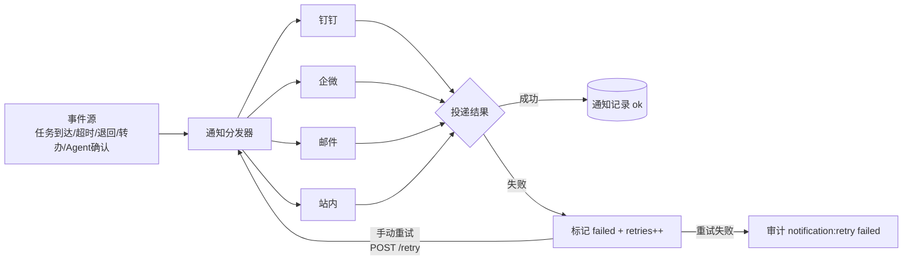
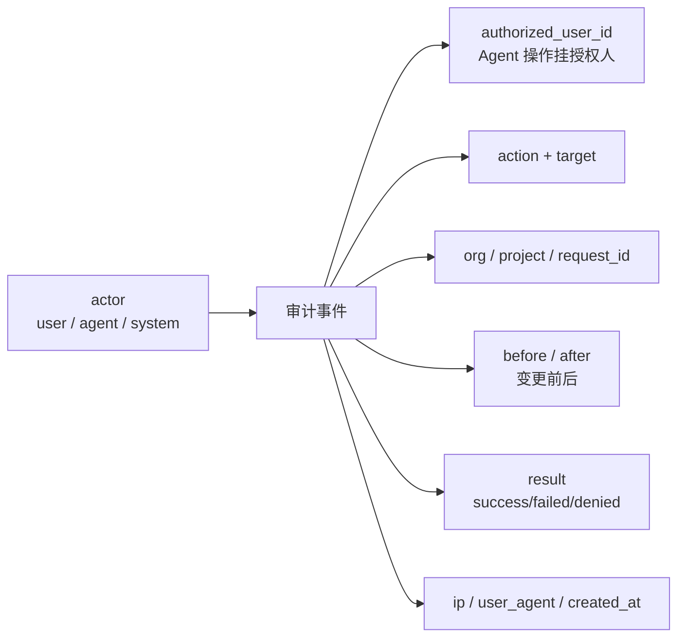

# 06 文档、通知与审计

来源：`frontend/src/data/mock.ts`（documents/notifications/auditRows）、`src/pages/documents.tsx`、`src/pages/notifications.tsx`、`src/pages/audit.tsx`、dialogs（RetryNotify/RegisterApprove）。

## 一、文档服务（MinIO 内网存储）

### 1.1 上传校验链（前端展示，后端必须实现）

- 支持：PDF / Markdown / Office / 原型（.fig）/ 压缩包（.zip）
- 病毒扫描状态：`已扫描` / `含毒` / `扫描中`
- **含毒 → 拒绝入库**，审计 `file:scan result=failed`（mock：导出日志导出_全量.zip 检出病毒）

### 1.2 访问控制

- 文件仅通过**权限代理**访问**短时链接**（`POST /documents/{id}/link`）
- 短时链接过期 → 403（mock 工作项 ISSUE-2026-0517「文件预览偶现 403：短时链接过期」）
- 下载写审计 `document:download`

### 1.3 敏感级别

- `L1`（内部）/ `L2`（受控）/ `L3`（机密）
- 文档中心列表按 level 过滤（all/L1/L2/L3/含毒）

### 1.4 文档类型 kind

需求文档 / 设计文档 / 测试结果 / 原型 / 截图 / 日志 / 接口文档 / 测试用例 / 问题报告 / 代码片段

### 1.5 与工作项关联

- `wi` 字段关联工作项；节点处理页展示**继承文档**（上游节点产出，只读，含版本与级别）
- 节点 schema 中 upload/file 字段的产出物进入文档库并关联节点

## 二、通知服务（多渠道中台）

### 2.1 渠道

钉钉 / 企微 / 邮件 / 站内（mock 常用 钉钉+企微）

### 2.2 通知类型（kind）

| kind | 触发场景 |
|---|---|
| arrive | 任务到达（节点自动分配） |
| agent | Agent 确认请求 |
| timeout | SLA 超时 |
| return | 任务退回 |
| complete | 流程完成/取消 |
| transfer | 任务转办 |
| info | 系统信息（密码过期/组织同步完成） |
| fail | 渠道发送失败 |

### 2.3 投递状态与重试

- 每条通知含 `channels: [{name, ok}]` 逐渠道投递结果
- 失败通知：`failed=true, retries=N`，可手动重试（`POST /notifications/{id}/retry`）
- 重试写审计 `notification:retry`（result=failed 时记录失败）
- 顶栏徽标「企微通知待重试 2 条」—— 需聚合统计待重试通知数

### 2.4 通知中心

- 未读计数（顶栏红点）；tab 过滤（全部/未读/失败）
- 「查看全部」跳通知中心页；点击 agent 类型 → 打开确认弹窗；arrive 类型 → 跳节点处理页

## 三、审计服务

### 3.1 记录字段（PRD §12 全链路）

### 3.2 必须审计的动作（前端实际触发）

| action | 场景 |
|---|---|
| task:claim / task:submit / task:return / task:transfer | 任务动作 |
| agent:generate_content / agent:upload_document 等 agent:* | Agent 操作（authorized=授权用户） |
| org:sync | 组织同步（system actor） |
| document:upload / document:download | 文档操作 |
| notification:retry | 通知重试（system actor） |
| workflow_template:edit | 模板编辑 |
| workflow_instance:cancel | 流程取消 |
| file:scan | 病毒扫描（system actor） |
| 角色/权限/用户变更 | 含 before/after diff |

### 3.3 查询与导出

- 过滤：action / result（success/failed/denied）/ actor_type（user/agent/system）
- **分页**：前端每页 5 条，真实分页（上一页/页码/下一页）
- **导出**：导出操作本身记录一条新审计（audit:export）；审计记录不可删除

### 3.4 权限联动

- 查看审计：audit:read（system_admin/organization_admin/project_admin/leader）
- 导出审计：audit:export（system_admin/organization_admin/project_admin）
- 无权限访问 → 403 + 审计 result=denied

## 四、失败重试与降级约定

- 外部渠道（钉钉/企微/邮件）失败 → 保留数据、标记渠道失败、可重试；不删除不破坏
- 组织同步失败 → 保留已有用户数据
- 所有失败均写审计（result=failed + failure_reason）
