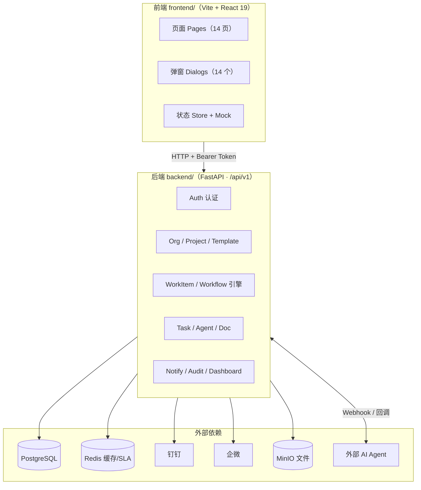

# FlowHub 后端开发文档（从前端代码反推）

> 依据：`frontend/src/types/index.ts`（领域类型）、`frontend/src/data/mock.ts`（数据契约）、`frontend/src/pages/*`（交互行为）、`frontend/src/components/dialogs.tsx`（弹窗/表单）。
> 目标：为后端开发提供与前端严格对齐的**数据模型、REST API、权限模型、工作流引擎、Agent 集成**规格。

## 系统架构

## 文档目录

| 文档 | 内容 |
|---|---|
| [01-领域模型.md](./01-领域模型.md) | 全部实体、字段、枚举、关系（ER） |
| [02-REST-API.md](./02-REST-API.md) | 全部端点（方法/路径/请求/响应/错误） |
| [03-认证与权限.md](./03-认证与权限.md) | 免登/本地账号、角色、34 个权限点、防自锁、审计 |
| [04-工作流引擎.md](./04-工作流引擎.md) | 模板/节点/流转/回退/绑定分配/SLA/画布 |
| [05-Agent-集成.md](./05-Agent-集成.md) | Agent 注册/绑定/调用/确认/回调/能力边界 |
| [06-文档与通知审计.md](./06-文档与通知审计.md) | 文件上传下载/病毒扫描/通知渠道/审计记录 |

## 总体约定

- **技术栈建议**：FastAPI（Python）+ PostgreSQL + Redis（可选），参照 `dev-flow/apps/api/src/flowhub_api`。
- **API 前缀**：`/api/v1`；统一返回 `{ code, message, data }`，HTTP 状态码与业务 code 并存。
- **分页**：`?page=1&page_size=20` → `{ items, total, page, page_size }`（前端审计/文档页每页 5 条，需真实分页）。
- **时间**：ISO 8601 UTC；前端展示本地化（当前 mock 用 `MM-DD HH:mm`）。
- **鉴权**：Bearer Token（免登票据/本地账号）；所有写操作必须写审计。
- **CORS**：允许前端 dev origin（`http://localhost:5173` / `5273`）。

## 前端页面 → 后端能力映射

| 前端页面 | 所需后端能力 |
|---|---|
| 登录页 | 免登验签（钉钉/企微）、本地账号登录、注册、改密 |
| 我的任务 | 任务列表（过滤/排序）、任务动作（认领/提交/退回/转办） |
| 通知中心 | 通知列表、渠道投递状态、重试 |
| 领导看板 | 看板聚合（KPI/周趋势/类型占比/部门负载/超时 Top/节点热度） |
| 项目列表 | 项目 CRUD、模板绑定（含节点处理人绑定） |
| 流程模板 | 模板版本管理、节点清单、发布/归档 |
| 流程画布 | 模板定义读写（节点/边/回退/Schema/SLA）、校验、快照版本 |
| 工作项详情 | 工作项详情、关联文档、处理历史、时间线 |
| 节点处理 | 节点任务处理、绑定候选处理人、表单 Schema 提交 |
| 文档中心 | 文件上传/列表/短时链接/病毒扫描/级别策略 |
| Agent 管理 | Agent 注册/挂起/激活/吊销、调用统计、能力边界 |
| 组织管理 | 用户 CRUD、角色/技能分配、组织同步、注册审批 |
| 权限矩阵 | 角色 CRUD、角色↔权限、角色↔用户、防自锁 |
| 审计中心 | 审计记录查询/导出（分页） |
